## **Name：Yikai Li**

**Video:** [turnaround + Shiny mode](https://youtu.be/5M0mF-luyEY)

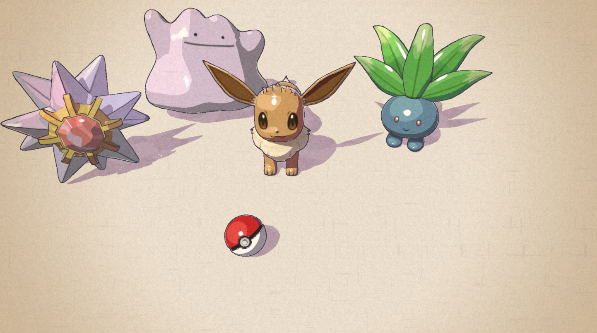

## Concept Art

Art by **[@caomor](https://twitter.com/caomor/status/1049494055518908416)**.

What I wanted to copy from it: soft pastel colors, shadows that drift toward blue/purple instead of just getting darker, little white highlight dots, thin dark outlines that are a darker version of each Pokémon's color, and the whole thing feeling like it's painted on paper.

---

## 1. Toon Surface Shader (`Toon Lit`)

Started from my 3-tone toon shader from the lab and kept adding stuff:

- **Multiple lights** — follows the additional-light tutorial (`ComputeAdditionalLighting` in `LightingHelp.hlsl`). Point lights get the same stepped ramp, so they show up as hard-edged color rings. I also multiply their color by the surface color, otherwise everything they touched looked washed out.
- **Rim light + specular dot** — `ToonHighlights.hlsl`. Rim is a thin band from `1 - N·V`, specular is a hard Blinn-Phong dot that disappears inside cast shadows. Both are lerped toward a color instead of added, so nothing blows out to white.
- **Custom shadow texture** — a seamless watercolor blotch texture sampled with **object UVs**, with a per-material `ShadowScale` so blotches look about the same size on everything. (I generated the texture procedurally with a small numpy script — periodic FFT noise, so it tiles by construction.)
- **Color palette** — see the extra credit below; this is where the blue-ish shadows come from.

| Multiple lights | Rim + specular | Watercolor shadows |
|:--:|:--:|:--:|
| 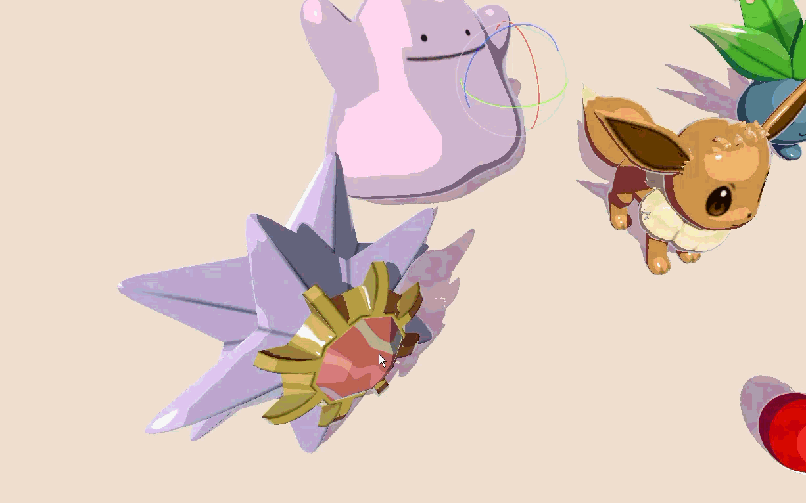 | 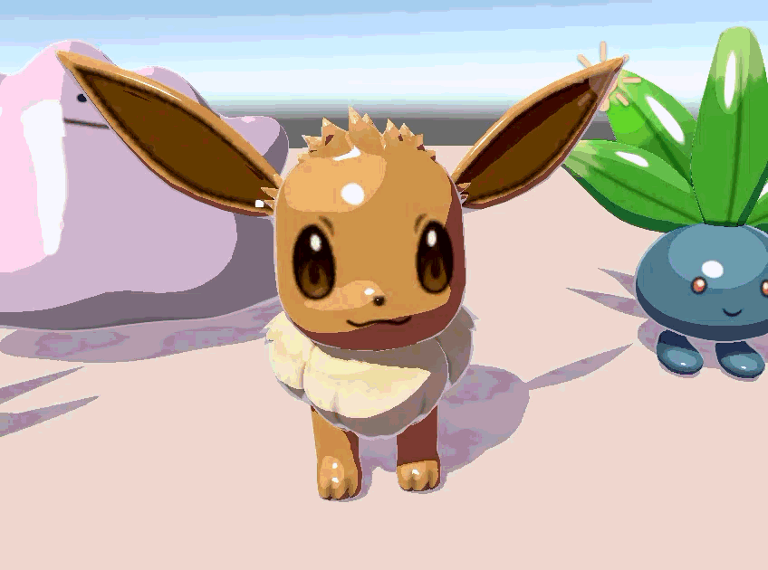 | 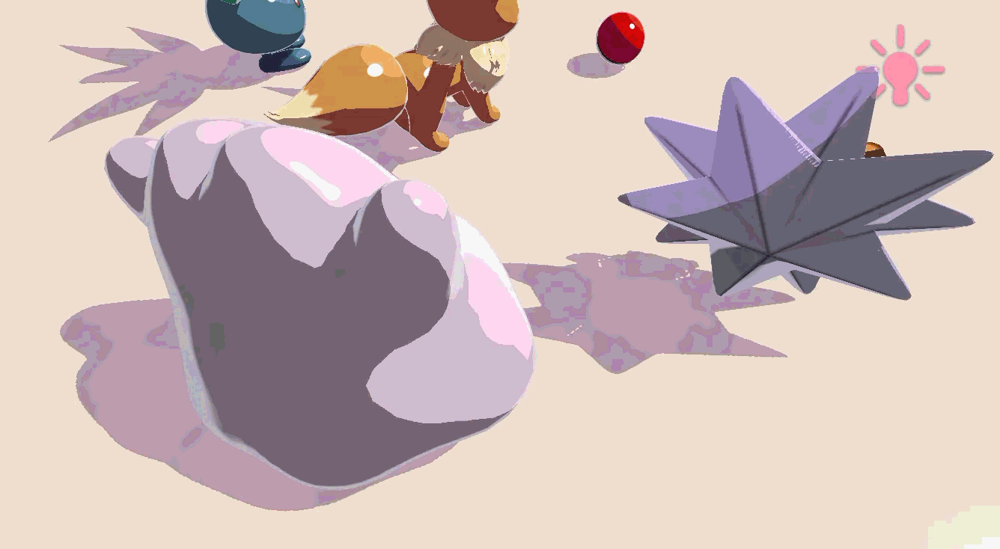 |

## 2. Special Shader — Starmie's Core (`Toon Lit Hero`)

Starmie's Pokédex entry says its core "glows brightly in seven colors", so that's the hero effect (Option 1, animated colors). `HeroGlow.hlsl`:

- The red gem stays, and **diagonal bands in seven hues** sweep across it.
- Time goes through `floor(Time * StepRate)` so it moves in little steps like hand-drawn animation.
- Value noise wobbles the band edges per facet, a triangle wave makes the gem "breathe", and screen-space noise adds tiny sparkles.
- `CoreGlowSync.cs` makes the point light next to Starmie follow the band colors (smoothly), so the glow spills onto the scene.

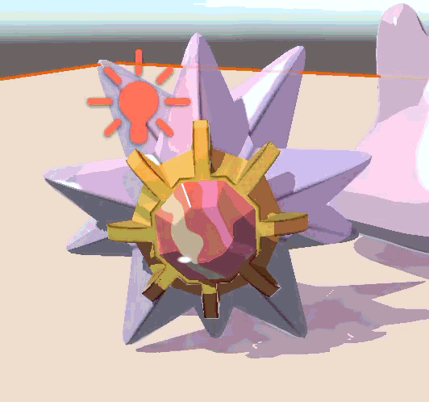

## 3. Outlines

- **Full Screen Feature fix:** it only blitted to the temp buffer and never back. Added `Blit(cmd, temporaryBuffer, colorBuffer)`. (Also learned the hard way that `_MainTex` in a fullscreen graph has to be **Exposed**, otherwise it never gets the screen texture.)
- **Normal buffer:** added the provided Normal Feature + Normal Copy material, writing into `Normal Buffer` at 1920×1080.
- **Outline shader** (`Outline.hlsl` + `Outline` fullscreen graph):
  - Depth edges use *relative* depth difference so near and far objects behave the same; normal edges catch the inner creases.
  - Both **Roberts Cross** and **Sobel** are implemented (`EdgeMethod`). I went with Roberts — thinner, cleaner lines that match the concept art better.
  - Only the silhouette (depth) lines **wobble**, with noise reseeded at a stepped rate ("boiling" lines). Inner lines stay still so the drawing keeps its structure. Line width also jitters a bit.
  - Line color = darker version of the object it outlines, mixed with a dark navy ink.

| Roberts Cross (used) | Sobel |
|:--:|:--:|
| 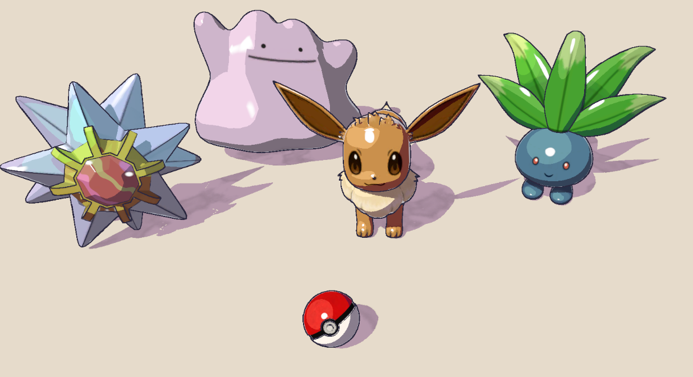 | 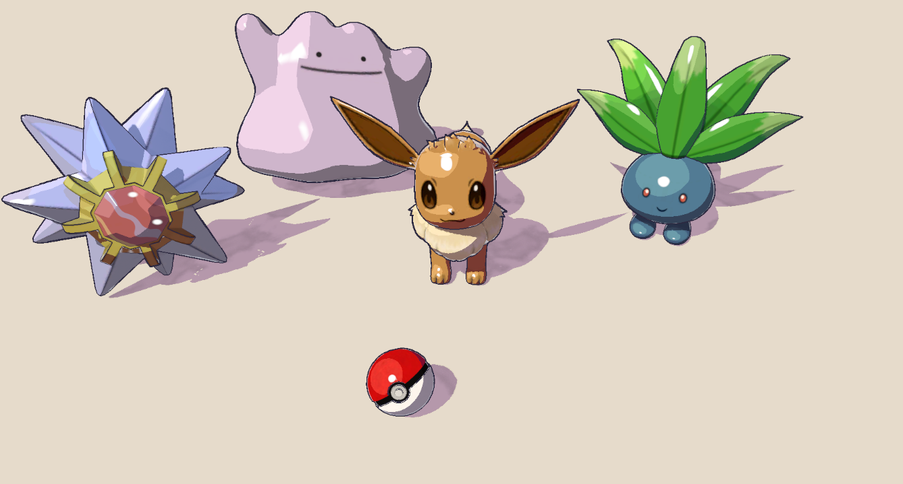 |

## 4. Post Process — Watercolor Paper

`WatercolorPaper.hlsl`, a third Full Screen Feature that runs after the outlines:

- slight wet-edge **bleed** (low-frequency UV wobble)
- **color grade**: lower saturation, lift toward paper white, a little warmer
- **pigment granulation**: paper grain shows up more where there's paint than on bare paper
- faint horizontal/vertical **paper fibers**
- warm **vignette**

| Off | On |
|:--:|:--:|
| 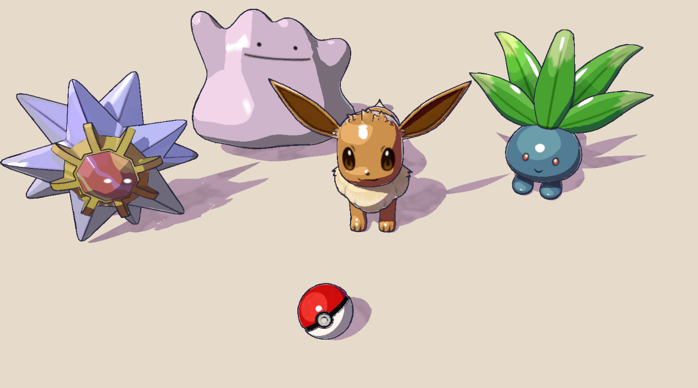 | 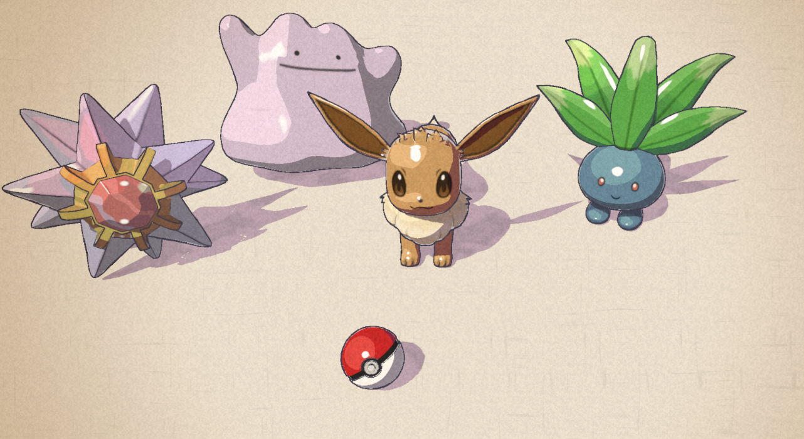 |

## 5. Scene

Five Pokémon on a sheet of paper, roughly following the concept art: Starmie, Ditto, Eevee, Oddish and a Poké Ball. One warm directional light from the upper left plus three point lights (core glow, warm fill, cool fill). The camera sits on a turntable (`Camera Pivot` + `Turntable.cs`).

## 6. Interactivity — Shiny Mode

Press **Space** to switch to Shiny mode (`ShinyMode.cs`):

- Ditto, Oddish and Starmie swap to their shiny textures (the models came with them).
- The paper post process swaps to a cooler, more saturated version.
- Eevee and the Poké Ball stay the same — not every Pokémon in the room is shiny :)

| Normal | Shiny |
|:--:|:--:|
| 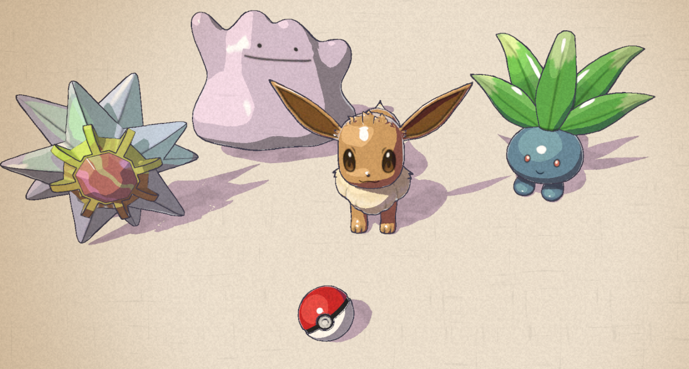 | 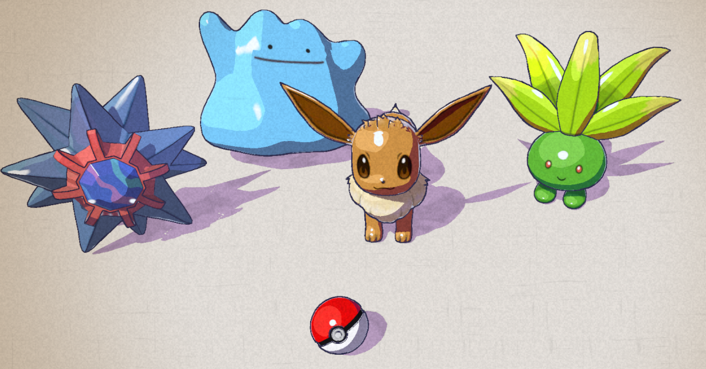 |

## Extra Credit — Texture Support + Procedural Coloring

The models keep their eyes and patterns in textures, so I added a `BaseMap` to the toon shader. Instead of picking three colors by hand, `ToonPalette.hlsl` builds the highlight / midtone / shadow from the texture color in HSV:

- **shadow**: hue shifts toward blue-violet, darker, keeps some saturation (so even white gets a lavender shadow)
- **highlight**: a bit lighter, warmer and less saturated
- **midtone**: the texture color itself

So it's not just "multiply by 0.6" — the shadows actually change hue like in the painting, and it works for every texture without hand-tuning.

---

## Where Things Are

| What | File |
|---|---|
| Toon shader | `Assets/Shaders/Toon Lit.shadergraph` |
| Hero shader | `Assets/Shaders/Toon Lit Hero.shadergraph` |
| Outline / paper graphs | `Assets/Shaders/Outline.shadergraph`, `Assets/Shaders/Watercolor.shadergraph` |
| HLSL | `Assets/Shaders/Includes/` (`LightingHelp`, `ToonHighlights`, `ToonPalette`, `HeroGlow`, `Outline`, `WatercolorPaper`) |
| Scripts | `Assets/Scripts/` (`ShinyMode`, `CoreGlowSync`, `Turntable`) |
| Scene | `Assets/Scenes/Submission.unity` |

## Credits

- Concept art: [@caomor](https://twitter.com/caomor/status/1049494055518908416)
- Models (all [CC BY 4.0](http://creativecommons.org/licenses/by/4.0/)):
  - [Ditto](https://sketchfab.com/3d-models/47a04e8d40dd49689bcc6158f1f8a821), [Oddish](https://sketchfab.com/3d-models/8d2eef1f8a694a5db5505157794fec83), [Starmie](https://sketchfab.com/3d-models/cb3cce8385934fa79373a3a5dd7854bd) by [nguyenlouis32](https://sketchfab.com/nguyenlouis32)
  - [Eevee](https://sketchfab.com/3d-models/eevee-9b7f0605ef1443d5a25757484ca484c7) by [drewsdigitaldesigns](https://sketchfab.com/drewsdigitaldesigns)
  - [Pokemon Basic Pokeball](https://sketchfab.com/3d-models/pokemon-basic-pokeball-9b29539199c14ddea4de7776c4d758df) by [JMGameDev](https://sketchfab.com/JMGameDev)
- Pokémon © Nintendo / Creatures Inc. / GAME FREAK inc. Used here for a non-commercial class project only.
- Tutorials linked in the assignment (additional lights, render features, depth/normal outlines).
